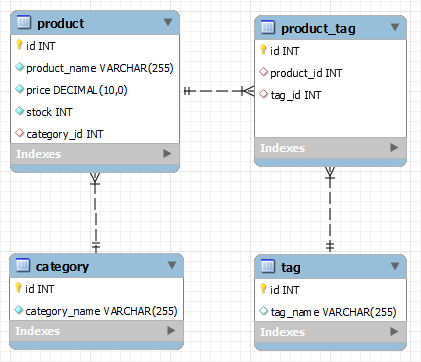
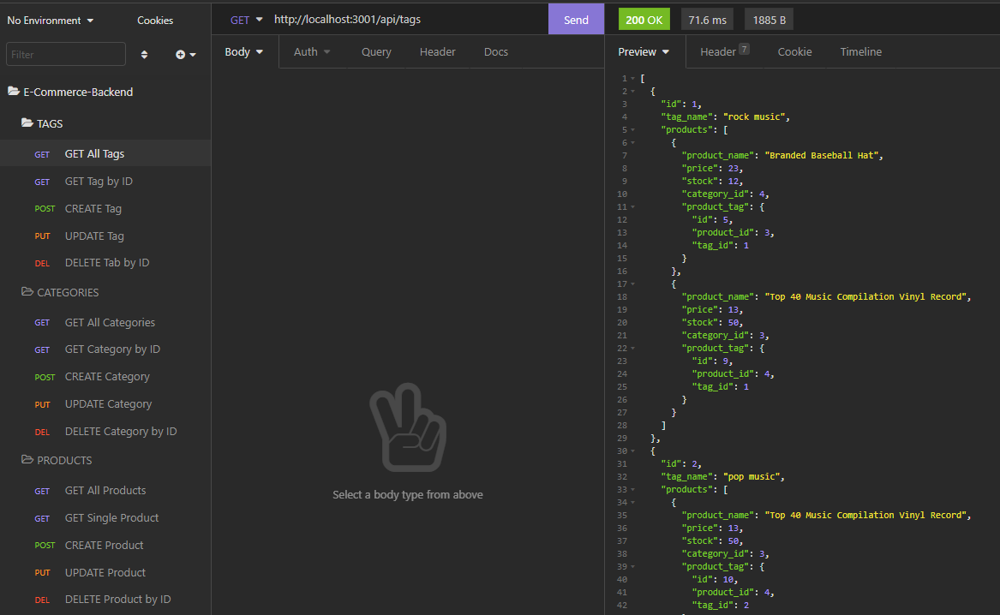

<h1 align = "center">E-Commerce Back End </h1>

---

1. [Description](#desc)
2. [Web Address](#webaddress)
3. [Usage Tips](#usage)
4. [Features](#feature)
5. [Install Command](#command)
6. [Credits](#credits)
7. [Licenses](#licenses)
8. [Questions and Contributing](#qnacontri)

---

## Description

This app is the backend of an E-Commerce where express.js used for the server and MySQL for the database along with Sequelize as the ORM to run SQL models. Also RESTful API routes are used to make request and update from the database using insomnia.

---

## Web Address

This app is terminal based. Hence, there is no front end available. In order to run the application please see install command and Usage Tips sections.

---

## Usage Tips

### E-Commerce to run locally perform the below step:-

- Download the Repo as ZIP file or clone it locally
- Open the repo folder to your favorite code editor
- install the dependency (listed in Install Command)
- run node index.js in your terminal

### E-Commerce Allows user to:-

- View all Tag, Categories, and Product
- Update an Tag, Categories, and Product by their IDs
- Add a new Tag, Categories, and Product
- Delete a Tag, Categories, and Product by their IDs

---

## App Features

### Database Design

### Video Tutorial

[Video Walkthrough](https://drive.google.com/file/d/17IVTpHL6rat6VUpuQaznSoWe9_LJkn0e/view?usp=sharing)

### Screenshots

### Download Insomnia API 
Download the .json file and import into your Insomnia environment for quick and easy CURD operations
[Insomnia API Download](./public/insomnia_api.json)

## Install Command

To install dependency enter the command "npm i" or npm install" in your terminal

### Dependency

- [mysql2](https://www.npmjs.com/package/mysql2)
- [express](https://www.npmjs.com/package/colors)
- [dotenv](https://www.npmjs.com/package/asciiart-logo)

### Launch the app

Run following command in your terminal `node server.js`

---

## Credits

[hrsautomation20](https://github.com/hrsautomation20)

---

## Licenses

  

---

## Questions and Contributing

### For Questions please reach out to Repo Owner :-

- GitHub - https://github.com/hrsautomation20
- Email - [H Rola](mailto:hrsautomation20@gmail.com?subject=[GitHub]%20Source%20Han%20Sans)

### For Contributing

Feel free to download or colone the repo and make local changes
